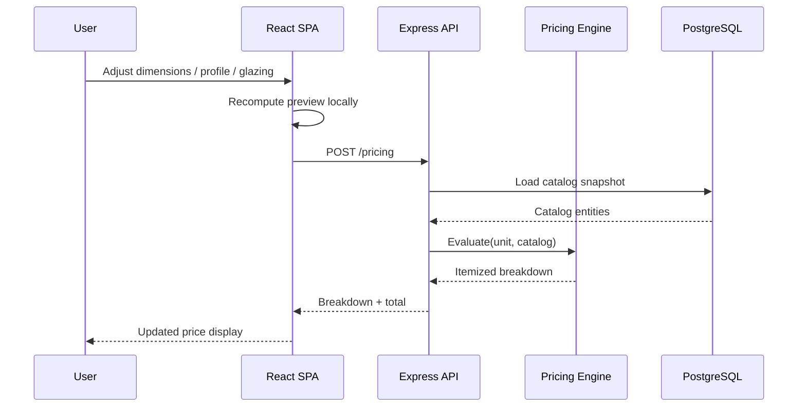

# Architecture

A high-level description of how WinCalc is structured. Implementation specifics, schema definitions, and pricing rules are intentionally omitted — the production source is private.

## Design Goals

1. **Instant feedback.** Configuring a unit must feel like using a desktop calculator, not submitting a form. Every parameter change recalculates and re-renders immediately.
2. **Explainable pricing.** A price is never a single opaque number. Every quote resolves to a breakdown a salesperson can defend in front of a customer.
3. **Reproducible history.** A quote issued last year must still be explainable, even after catalog prices change.
4. **Data-driven catalog.** Adding a profile system or a glass type is a data operation, not a deployment.
5. **Local-first ergonomics.** The application is designed for intermittent connectivity and modest hardware, which shapes both state management and payload sizes.

## Layers

```
┌─────────────────────────────────────────────────────────┐
│ Presentation                                            │
│   React SPA · configurator · quotations · BOM · admin   │
└───────────────────────────┬─────────────────────────────┘
                            │ HTTPS / JSON
┌───────────────────────────▼─────────────────────────────┐
│ Application                                             │
│   Express API · authentication · orchestration          │
└──────────┬────────────────────────────┬─────────────────┘
           │                            │
┌──────────▼──────────┐      ┌──────────▼─────────────────┐
│ Domain              │      │ Persistence                │
│   pricing engine    │      │   PostgreSQL               │
│   unit model        │      │   catalog · customers ·    │
│   geometry / preview│      │   calculations · quotes    │
└─────────────────────┘      └────────────────────────────┘
```

### Presentation

A single-page React application. Navigation is route-based, with secondary surfaces loaded lazily so the configurator — the surface users live in — stays fast to reach. Application state is held in a lightweight store rather than pushed through component trees, because the configurator updates many independent values per interaction.

Two previews are rendered from the same unit model: a 2D technical drawing for precision and a 3D view for comprehension. Deriving both from one source of truth is what keeps the drawing, the model, and the price consistent.

### Application

An Express API that owns authentication, catalog access, pricing orchestration, and document generation. It is stateless, which allows it to scale or restart without losing work.

In production the API can also serve the built SPA. This makes a single-service deployment possible when a simpler topology is preferable to a split frontend/edge deployment.

### Domain

The pricing engine is the heart of the system and is deliberately isolated from the data layer. It takes a configured unit plus a catalog snapshot and returns an itemized breakdown. Because it has no database dependency, it is unit-testable in isolation and is the most heavily tested part of the codebase.

Pricing is expressed as **rules** rather than imperative branches. A rule describes a condition and an effect — a surcharge, a discount, a minimum, a rounding policy. This means a commercial policy change is a data change. It also means a price can be explained by listing the rules that fired.

### Persistence

PostgreSQL is the system of record. Catalog entities are referenced by identity rather than copied into calculations, and the resolved pricing context is captured alongside a saved calculation. Together these give reproducible history: a stored quote can be re-explained against the catalog state that produced it, even after prices move.

## Request Flow — Pricing a Unit



The preview is recomputed on the client for immediate feedback. Authoritative pricing is resolved server-side so that a price can never be produced by a tampered client.

## Security Model

- **Authentication** — JWT-based sessions with hashed credentials; no plaintext secrets at rest
- **Authorization** — role separation between administrative and operational surfaces, enforced server-side rather than by hiding UI
- **Secrets** — database credentials, signing keys, and service URLs are supplied as environment variables and never committed
- **Uploads** — file uploads are validated and stored outside the application bundle
- **Transport** — all production traffic is served over TLS

## Deployment Topology

| Layer | Host | Notes |
|-------|------|-------|
| SPA | Vercel | Static build, edge-cached, proxies `/api/*` to the API |
| API | Render | Node runtime, health-checked |
| Database | Managed PostgreSQL | Separate lifecycle from application services |

Proxying the API through the frontend origin keeps the browser on a single origin, which removes an entire class of CORS and cookie-scope problems. Asset caching is split deliberately: the HTML entry point is never cached, while hashed asset filenames are cached immutably.

## Testing

The pricing engine is covered by a unit test suite that runs without a database. This is intentional — the highest-risk logic in the system is also the easiest to test, so it is tested most.

## Deliberate Trade-offs

- **Server-resolved pricing over client-only pricing** — costs a round trip on change, buys the guarantee that a price cannot be forged in the browser.
- **Catalog references over denormalized snapshots** — costs a join at read time, buys catalog integrity and correct historical explanation.
- **Single PostgreSQL instance over a distributed store** — the workload is transactional and relational; a distributed store would add operational cost without addressing a real constraint.
