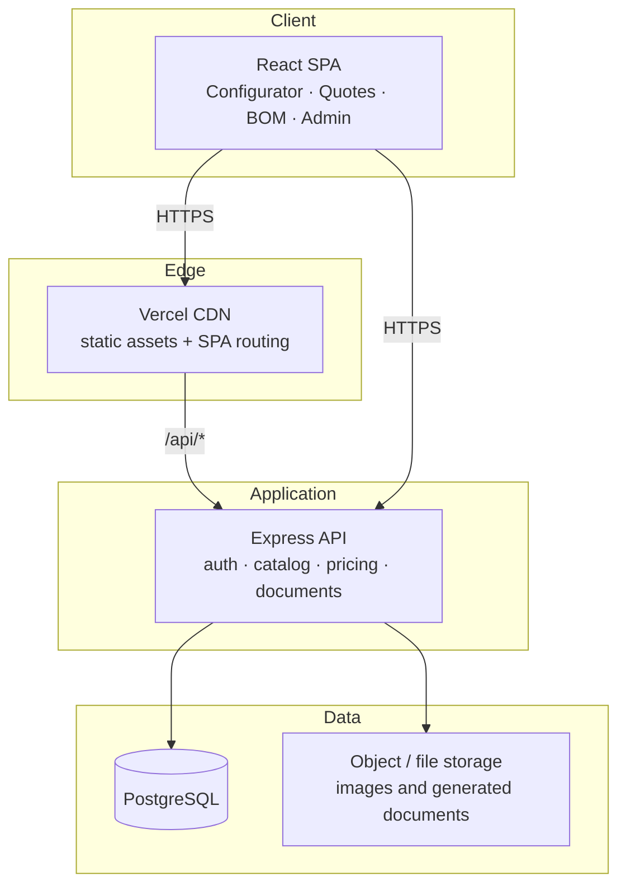

# WinCalc

> A configure–price–quote application for PVC and aluminium windows and doors — configure a unit, see a live preview, get an itemized price, and issue a quotation, bill of materials, or PDF.

## Live Demo

Deployment is being re-provisioned. The verified production URL will be published here once the backend service and managed database are restored.

> The previous deployment pointed at a source repository on a retired GitHub account, and its managed database has since been removed. The application source is intact and builds cleanly; the production stack is being rebuilt. See [Project Status](#project-status).

## Overview

WinCalc is a quoting tool for window and door fabricators and installers. The workflow it replaces is the spreadsheet-and-calculator routine that most small fabricators still use: measuring a unit, looking up profile and glass prices, applying labour and margin, and writing the result into a quote by hand.

The application turns that into a structured pipeline. A unit is configured by type, dimensions, profile system, glazing, colour, hardware, and accessories. The result is priced from a configurable catalog with explicit pricing rules, previewed visually, and persisted as a calculation that can be reused, exported, or rolled into a customer quotation.

The interface follows the **Windows 11 Fluent** design language — Segoe UI typography, system accent colour, and light/dark themes — with the interaction model of a desktop calculator: a large result display, instant recalculation as parameters change, and keyboard shortcuts for the common actions.

## Features

- **Parametric configurator** — configure window and door units by type, dimensions, opening direction, and construction details
- **Live visual preview** — a 2D technical preview that updates as the unit is configured, plus a 3D representation of the assembled unit
- **Itemized pricing** — every unit resolves to a transparent cost breakdown: profile, glazing, hardware, accessories, labour, and margin
- **Configurable catalog** — window types, profile systems, glass types, colours, hardware, handles, and accessories are all data-driven rather than hard-coded
- **Pricing rules engine** — pricing behaviour is expressed as rules, so commercial changes do not require a code change
- **Quotations and calculations** — save, revisit, duplicate, and revise calculations, then generate a customer-facing quotation
- **Bill of materials** — derive a per-order BOM from configured units for procurement and cutting
- **PDF export** — produce branded quotation and BOM documents
- **Customer records** — keep customers alongside their calculations and quotations
- **Role-based access** — separate Administrator and Employee surfaces
- **Multi-language** — Albanian, English, and Romanian, with the interface built for additional locales
- **Backup and restore** — administrative backup tooling for the catalog and business data

## Technology

**Frontend**
- React 19 with Vite
- Tailwind CSS 4
- Zustand for application state
- React Router for navigation, with route-level code splitting
- React Three Fiber for 3D unit preview
- Recharts for administrative reporting
- i18next for localization

**Backend**
- Node.js with Express
- PostgreSQL as the system of record
- JWT-based authentication with bcrypt password hashing
- PDF generation for quotations and bills of materials

**Infrastructure**
- Frontend served from Vercel's edge network
- API and background services hosted on Render
- Managed PostgreSQL for production data

## Architecture

The pricing engine is deliberately isolated from the data layer: pricing behaviour is expressed as rules evaluated against a configured unit and a catalog snapshot, which keeps the calculation reproducible and testable independently of the database.

For a fuller breakdown, see [`ARCHITECTURE.md`](ARCHITECTURE.md).

## Screenshots

Screenshots are captured against a running instance and will be added alongside the restored live demo. The application is a login-gated business tool, so preview imagery is produced from a seeded demonstration dataset rather than production data.

## Technical Highlights

- **Rule-driven pricing** — pricing is resolved from composable rules rather than imperative branching, so a new commercial policy is a data change, not a release
- **Reproducible quotes** — a saved calculation captures the inputs and resolved pricing context, so a quote issued months ago can be explained and reproduced
- **Parameterized preview** — the 2D technical preview and 3D model are both derived from the same unit model, so geometry, dimensions, and the priced configuration cannot drift apart
- **Route-level code splitting** — secondary surfaces are lazily loaded, keeping the initial bundle small and the configurator responsive
- **Optimistic, recalculation-first UI** — the configurator recalculates immediately on change, which is the interaction model the target users expect from desktop tools
- **Multi-tenant catalog design** — catalog entities are versioned and referenced by id, so historical quotes remain valid when the catalog changes

## Deployment

The production topology is a split deployment:

| Layer | Host | Responsibility |
|-------|------|----------------|
| Frontend | Vercel | Static SPA build, edge caching, API reverse-proxy |
| API | Render | Express application, authentication, pricing, document generation |
| Database | Managed PostgreSQL | Catalog, customers, calculations, quotations |

The frontend is deployed as a static build and proxies `/api/*` to the API service, which keeps the browser on a single origin and avoids cross-origin configuration in the client. The API also has the capability to serve the built SPA directly, which allows the whole application to run as a single service when a simplified topology is preferable.

Configuration is environment-driven. Database credentials, JWT signing secrets, and service URLs are supplied as environment variables at deploy time and are never committed to source control.

## Project Status

**Active development — production stack being rebuilt.**

The application source is complete and builds cleanly. The previously configured production deployment is not currently serving, for reasons outside the application code:

- The API service was connected to a source repository on a GitHub account that is no longer accessible
- The managed PostgreSQL instance backing production has been removed
- The frontend project remains on a Vercel team that the current account cannot administer

Repairing this requires re-pointing the API service at the current source repository, provisioning a replacement managed database, and reconnecting the frontend project. Screenshots and the verified live demo link will be published here once the stack is serving again.

## Ownership

Built by **[ulasmango-cmd](https://github.com/ulasmango-cmd)**.

- GitHub profile: https://github.com/ulasmango-cmd
- Production source: private

## License

The implementation is proprietary. This repository contains portfolio documentation only; it does not grant rights to copy, modify, or redistribute the production source code, pricing logic, or brand assets.
